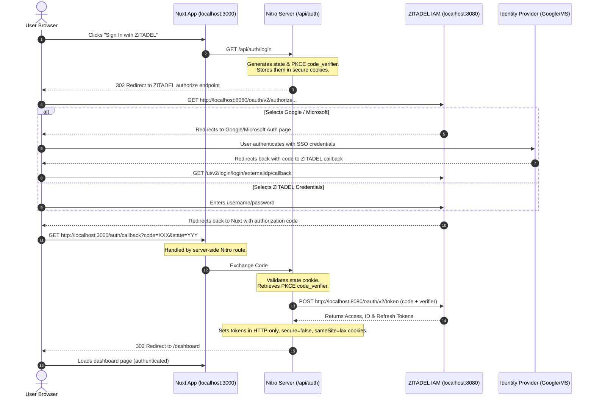

# 📊 LedgerFlow — Domain-Driven Accounting Dashboard

LedgerFlow is a modern, high-performance accountant tracking frontend dashboard built from scratch using **Nuxt.js (Vue 3)**, **Pinia**, and **TypeScript**. 

Authentication is managed dynamically using a self-hosted **ZITADEL** IAM service integrated with external Single Sign-On (SSO) providers (**Google** and **Microsoft Entra ID**). Session states are governed by cryptographically secured server-side `httpOnly` cookies.

---

## 🌟 Project Versions

LedgerFlow is developed across two major version releases:

### 🚀 Version 2.0 (Current — Tailwind CSS, ZITADEL OIDC & Receipts Logic)
- **Styling**: Migrated entirely to **Tailwind CSS** integrated with a dynamic, CSS variable-based theming engine (fully supporting light/dark schemes and customizable in [main.css](file:///home/user/Desktop/frontend_vue_nuxt/src/assets/main.css)).
- **Authentication**: Secured with **ZITADEL OIDC (OAuth 2.0 Authorization Code Flow with PKCE)**. Session tokens are saved in secure, server-managed `httpOnly` cookies.
- **SSO Integration**: Federated authentication via **Google SSO** and **Microsoft Entra ID** configured as Identity Providers (IDPs) in ZITADEL.
- **Core Accounting Logic**: 
  - **Total Income**: Computed from merchant/customer **receipts** (`receipts`).
  - **Total Expenses**: Computed from logged **operational expenses** (`expenses`).
  - **Outstanding Dues**: Computed from **Pending** and **Overdue** invoices.
  - **Interactive Actions**: The "Mark Paid" trigger in the invoice ledger is styled as a responsive solid accent button.

### 📜 Version 1.0 (Legacy — Vanilla CSS & Paid Invoices Logic)
- **Styling**: Styled using premium **Vanilla CSS** featuring glassmorphism and custom animation components.
- **Core Accounting Logic**:
  - **Total Income**: Computed from invoices marked with status `'Paid'`.
  - **Total Expenses**: Computed from the sum of general expenses and merchant receipts.
  - **Outstanding Dues**: Computed from unpaid customer invoices.
- **Git Tag**: This stable version has been pushed to Git under the tag `v1.0`.

---

## 🔐 ZITADEL SSO Integration Setup Guide

LedgerFlow leverages ZITADEL to federate logins across multiple identity providers. Below is the configuration lifecycle for ZITADEL and external SSO providers.

### 1. ZITADEL Initial Configuration (Project & PKCE)
Before configuring external SSO providers, you need to register the LedgerFlow application inside your ZITADEL console:

1. **Access ZITADEL Console**:
   Go to `http://localhost:8080/` and sign in with the automatically generated ZITADEL administrative user.
2. **Select or Create Organization**:
   - In ZITADEL, ensure you have an active Organization (e.g. `LedgerFlow Org` or Default).
3. **Create a Project**:
   - Navigate to the **Projects** tab.
   - Click **Create Project** -> Name it `LedgerFlow-Authentication`.
4. **Register a Web Application**:
   - Within the project page, click **New Application** to register a client.
   - Name the application (e.g. `LedgerFlow Nuxt App`).
   - Select **Web** (for server-side rendered applications like Nuxt 3/4).
   - Click **Continue**.
5. **Configure PKCE & Authentication Method**:
   - Select **Code** (Authorization Code Flow) as the OAuth grant type.
   - Choose **PKCE (Proof Key for Code Exchange)** as the authentication method to guarantee secure code-to-token code validation without hardcoding backend client secrets.
6. **Set Redirect and Logout URIs**:
   - Configure **Redirect URIs**: `http://localhost:3000/auth/callback`
   - Configure **Post-Logout Redirect URIs**: `http://localhost:3000/`
   - Click **Create**.
7. **Obtain Client ID**:
   - Copy the generated **Client ID** (e.g. `379545720174149635`) and update it in your application constants or environment variables.

### 2. Google SSO (OAuth Client Setup)
To allow users to sign in with Google accounts:
1. Navigate to the [Google Cloud Console Auth Clients](https://console.cloud.google.com/auth/clients?authuser=1&organizationId=0&project=ledgerflow-authentication).
2. Click **Create Credentials** -> **OAuth Client ID**.
3. Select **Web Application** as the application type.
4. Add **Authorized JavaScript Origins**:
   - `http://localhost:8080` (Points to the self-hosted ZITADEL proxy domain)
5. Add **Authorized Redirect URIs**:
   - `http://localhost:8080/ui/v2/login/login/externalidp/callback` (Standard callback endpoint where Google sends the auth code back to ZITADEL)
6. Copy the generated **Client ID** and **Client Secret**.

### 3. Microsoft Entra ID (App Registration Setup)
To allow users to sign in with Microsoft accounts:
1. Navigate to the [Microsoft Entra App Registrations portal](https://entra.microsoft.com/#view/Microsoft_AAD_RegisteredApps/ApplicationsListBlade).
2. Click **New Registration**.
3. Name your app (e.g. `LedgerFlow IAM Gateway`) and choose the supported account type (e.g., Multitenant or Single organization).
4. Select **Web** as the Redirect URI platform and configure it with:
   - `http://localhost:8080/ui/v2/login/login/externalidp/callback`
5. Once registered, copy the **Application (client) ID** and **Directory (tenant) ID** from the overview panel.
6. Under **Certificates & secrets**, click **New client secret** and copy the secret **Value**.

### 4. Map Identity Providers (IDPs) in ZITADEL
Once the credentials are created on Google/Microsoft:
1. Log in to the ZITADEL Console at `http://localhost:8080/` as an administrator.
2. Go to **Instance Settings** -> **Identity Providers**.
3. Click **New** -> Select **Google** or **Microsoft**:
   - Paste the respective **Client ID** and **Client Secret**.
   - For Microsoft Entra ID, configure the Tenant option as required (e.g. `common` or specific Tenant ID).
   - Enable scopes: `openid`, `profile`, `email`.
4. Go to **Instance Settings** -> **Login Policy** and toggle your newly created providers to **Active** to render the Google/Microsoft buttons on the ZITADEL login portal interface.

---

## 🔄 Authentication Redirection Lifecycle

Here is how data flows sequentially through the application during sign-in:



### Key Server-Side Route Implementations (Root `server/` Directory)
- [server/api/auth/login.get.ts](file:///home/user/Desktop/frontend_vue_nuxt/server/api/auth/login.get.ts): Creates OIDC `state` and PKCE `code_verifier`/`code_challenge` parameters. Sets temporary tracking cookies and redirects the browser to ZITADEL.
- [server/routes/auth/callback.get.ts](file:///home/user/Desktop/frontend_vue_nuxt/server/routes/auth/callback.get.ts): Intercepts the final authorization code callback. It performs a backend `POST` query to exchange the code for access/ID/refresh tokens, deletes verification cookies, sets token cookies as `httpOnly`, and redirects to `/dashboard`.
- [server/api/auth/logout.get.ts](file:///home/user/Desktop/frontend_vue_nuxt/server/api/auth/logout.get.ts): Clears token cookies locally, then redirects to ZITADEL's `end_session` endpoint with an `id_token_hint` parameter to log the user out completely.
- [server/api/auth/me.get.ts](file:///home/user/Desktop/frontend_vue_nuxt/server/api/auth/me.get.ts): Checks the `id_token` cookie, decodes the JWT payload segment, and extracts OIDC claims (e.g. `sub`, `name`, `email`) to serve current profile properties to the default layout sidebar.

---

## 🛡️ Route Protection & Session Checks

Authentication is managed via Nuxt's global route middleware [middleware/auth.global.ts](file:///home/user/Desktop/frontend_vue_nuxt/src/middleware/auth.global.ts):
- During navigation, the middleware invokes the client composable `fetchUser()` action.
- During initial SSR page loads, `useAuth()` forwards browser cookies to the backend endpoint `/api/auth/me` using `useRequestHeaders(['cookie'])`.
- If the user is unauthenticated and attempts to visit `/dashboard`, they are redirected to `/`.
- If an authenticated user attempts to visit the `/` login landing page, they are automatically forwarded to `/dashboard`.

---

## 📂 Codebase Architecture: Domain-Driven Design (DDD)

Rather than using a traditional layout where files are grouped by technical type (e.g., all components in one folder, all composables in another), LedgerFlow is structured using **Domain-Driven Design (DDD)**. We cluster files by their **business domain feature**.

Here is how the `/src` folder is organized:

```
src/
├── domains/                    # Domain Modules (Isolated feature business logic & UI)
│   ├── invoice/                # Customer Invoices Domain (Paid, Pending, Overdue tracking)
│   ├── receipt/                # Merchant Receipts Domain (Expense uploading & categorizing)
│   ├── expense/                # Operational Expenses Domain (Rent, software, utilities)
│   ├── bank-record/            # Bank Records Domain (Ledger transactions & balance calculations)
│   └── dashboard/              # Dashboard Domain (Overall statistics aggregation & SVG charts)
│
├── shared/                     # Shared Cross-cutting Utilities and Components
│   ├── components/             # Reusable UI inputs (AppButton, AppInput, AppSelect, AppModal)
│   ├── composables/            # Shared useAuth session state composables
│   ├── utils/                  # Utility helpers (localStorage storage, date/currency formatters)
│   └── services/               # Common mock configurations
│
└── app.vue                     # Global entrypoint rendering the active Nuxt route
```

### Inner Folder Structure of a Domain Module
Within each domain folder (e.g., `src/domains/invoice/`), the code is divided into standard subfolders based on architectural responsibility:
- **`types/`**: Holds TypeScript interfaces and type definitions (e.g., `Invoice` and `CreateInvoiceInput`) defining the domain's core data structures.
- **`services/`**: Implements domain operations and interacts with data repositories (e.g., reading/writing data lists to LocalStorage, validating business parameters).
- **`store/`**: Defines the Pinia state management store (e.g., `useInvoiceStore`) to hold current reactive state lists and expose actions.
- **`composables/`**: Exposes lightweight Vue composition functions (e.g., `useInvoice`) wrapping store states and methods for presentation binding.
- **`components/`**: Holds isolated UI elements specific only to this domain (e.g., `InvoiceTable` lists, `InvoiceForm` modal inputs).
- **`pages/`**: Contains page shell views or containers specific to that feature.

---

## 🐳 Docker Deployment Methods

You can deploy the LedgerFlow stack using either a **unified Docker Compose** stack (all-in-one) or by running the **frontend standalone container** connected to the existing ZITADEL compose network.

### Method 1: Unified Docker Compose (Not Yet Implemented)
You can deploy the entire stack—including PostgreSQL, ZITADEL API, ZITADEL Login, Traefik proxy, and the LedgerFlow frontend—with a single command using the [docker-compose.yml](file:///home/user/Desktop/frontend_vue_nuxt/docker-compose.yml) at the root of the project:
```bash
docker compose up -d --wait
```
This runs the frontend using the precompiled image `jenson07/ledgerflow-app-nuxt:zitadel-v1` and exposes it on `http://localhost:3000/`.

---

### Method 2: Standalone Frontend + ZITADEL Compose Network
If you prefer running ZITADEL/PostgreSQL using the existing compose setup in the `/home/user/Desktop/zitadel compose` directory, and running the Nuxt frontend separately as a standalone container:

1. **Spin up ZITADEL Compose**:
   ```bash
   cd "/home/user/Desktop/zitadel compose"
   docker compose up -d --wait
   ```
   This initializes ZITADEL on the Docker bridge network named `zitadel`.

2. **Run the Standalone Nuxt Container**:
   Run the frontend container connected to the same `zitadel` network. You **must** include the `--add-host=localhost:host-gateway` mapping so the frontend container's backend can resolve ZITADEL on `localhost:8080` via your host gateway:
   ```bash
   docker run -d \
     --name ledgerflow-zitadel \
     --network zitadel \
     --add-host=localhost:host-gateway \
     -p 3000:3000 \
     jenson07/ledgerflow-app-nuxt:zitadel-v1
   ```

### Why `--add-host=localhost:host-gateway` is Required:
Inside the standalone frontend container, `localhost` defaults to the container's own internal loopback interface (`127.0.0.1`). Since ZITADEL is running in a separate container, the frontend's backend code cannot connect to ZITADEL on `localhost:8080` without mapping. Adding `--add-host=localhost:host-gateway` tells Docker to route `localhost` requests back out to the host gateway where Traefik proxy is listening on port `8080`, facilitating smooth, secure OIDC token exchange.

---

## 🛠️ Troubleshooting & Common Configuration Errors

If you run into issues while testing your ZITADEL or SSO integration, verify the following configurations:

### 1. `redirect_uri_mismatch` on ZITADEL
- **Problem**: Occurs when ZITADEL redirects the user back to Nuxt, but the Callback URL does not match what ZITADEL has configured for the client application.
- **Fix**: Open the ZITADEL console, navigate to your Project -> App Settings, and ensure that the **Redirect URI** is explicitly set to:
  `http://localhost:3000/auth/callback` and post-logout redirect URI is `http://localhost:3000/` (matching trailing slashes and ports exactly).

### 2. `redirect_uri_mismatch` on Google or Microsoft
- **Problem**: Occurs when Google or Microsoft redirects the user back to ZITADEL, but ZITADEL's callback URL does not match the allowed redirect list in Google Cloud or Microsoft Entra ID.
- **Fix**: Ensure that ZITADEL's external callback endpoint is exactly added to the provider console:
  `http://localhost:8080/ui/v2/login/login/externalidp/callback`

### 3. `invalid_client` or Invalid Client Secret
- **Problem**: ZITADEL fails to fetch user details from Google or Microsoft during code exchange.
- **Fix**: Check that the **Client Secret** value (not the Secret ID) was copied correctly from Entra ID or Google Console. Make sure there are no trailing whitespaces.

### 4. 404 Page Not Found on `/api/auth/login`
- **Problem**: Nuxt fails to locate the backend server route.
- **Fix**: In Nuxt, the `server/` folder must live at the **root of the project directory** (sibling to `nuxt.config.ts`), *not* inside the `src/` directory. Double check that it is placed in `./server/` instead of `./src/server/`.
